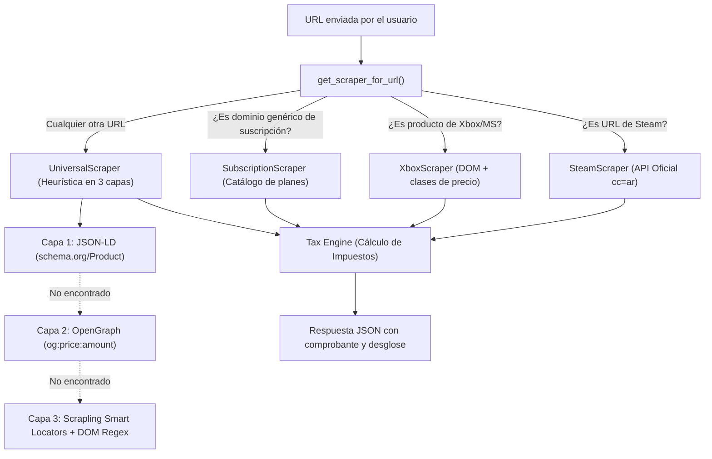

# 🇦🇷 Impuesto Argento - Documento de Contexto Técnico y Arquitectura (CONTEXT.md)

Este documento centraliza **todo el conocimiento del proyecto**: decisiones de arquitectura, lógica tributaria argentina, funcionamiento del motor de scraping (Scrapling), endpoints del backend, problemas identificados, soluciones aplicadas y la hoja de ruta técnica para escalarlo.

---

## 1. Visión General del Proyecto

**Impuesto Argento** es una plataforma pensada para que cualquier consumidor argentino pueda conocer el **precio real final** de cualquier compra en moneda extranjera o servicio digital del exterior, desglosando con exactitud quirúrgica cada impuesto nacional y provincial vigente.

### Capacidades Actuales (v2.0):
1. **Scraping de URLs en tiempo real**: El usuario pega un link de Steam, Microsoft Store / Xbox, PlayStation, Amazon o cualquier e-commerce, y el sistema extrae el título, miniatura y precio oficial, calculando los impuestos en segundos.
2. **Catálogo de Suscripciones Populares**: Grilla interactiva con Netflix, Spotify, YouTube Premium, Disney+, Max, Xbox Game Pass, ChatGPT Plus, Claude Pro, Midjourney, Google One, iCloud, etc., con cálculo tributario automático según la provincia.
3. **Calculadora Manual Rápida**: Entrada manual para cálculos rápidos sin necesidad de ingresar una URL.
4. **Comparador Dólar Tarjeta vs. Dólar MEP**: Calcula automáticamente cuánto dinero se ahorra el usuario si paga el saldo en dólares de su tarjeta desde su caja de ahorro (exento del 30% de percepción).
5. **Arquitectura Híbrida y Resiliente**: Si el backend de Python está online, ofrece la potencia de Scrapling; si está apagado, el frontend conmuta automáticamente a modo local sin interrumpir la experiencia.

---

## 2. Lógica Tributaria Argentina Vigente

El motor tributario está implementado en dos versiones idénticas y sincronizadas:
- En TypeScript: [`src/lib/tax-engine/`](file:///d:/Escritorio/impuesto-argento/src/lib/tax-engine/) (para ejecución en el navegador/cliente).
- En Python: [`scraper-service/app/core/tax_engine.py`](file:///d:/Escritorio/impuesto-argento/scraper-service/app/core/tax_engine.py) (para el backend de scraping).

### Normativa Vigente Relevada:

| Concepto | Alícuota | Norma | Aplicación |
| :--- | :--- | :--- | :--- |
| **IVA Servicios Digitales del Exterior** | **21%** | Decreto 813/2018 | Aplica sobre el precio neto en pesos de servicios de software, streaming y videojuegos. |
| **Percepción Ganancias / Bienes Personales** | **30%** | RG (ARCA) 5617/2024 | Aplica sobre consumos con tarjeta en pesos. Es pago a cuenta recuperable anualmente. |
| **Impuesto PAÍS** | **0% (Eliminado)** | Ley 27.541 | **Venció el 2/1/2026** tras cumplir sus 5 años de vigencia legal. Ya NO se cobra. |
| **Percepción de IIBB Provincial** | **0% a 5,5%** | Resoluciones de cada fisco provincial | Grava el consumo de servicios digitales del exterior según la provincia del usuario. |

### El Gran Secreto Tributario: Servicios del Exterior en Pesos vs Dólares
* **Caso A (Servicios en USD - Steam, PlayStation, ChatGPT)**:
  - Base imponible: `Monto USD × Dólar Oficial`.
  - En la tarjeta entra como: `Dólar Tarjeta (Oficial + 30%) + 21% IVA + IIBB`.
* **Caso B (Servicios en ARS - Xbox Store, Netflix, Spotify, Prime Video)**:
  - Aunque muestran el precio en pesos (ej. $5.000 ARS), figuran en el **Listado de Prestadores del Exterior de ARCA (RG 4240)**.
  - El banco actúa como agente de retención y cobra: `Base ARS + 21% IVA + 30% Ganancias (RG 5617) + IIBB provincial`.
* **Caso C (Bienes Físicos / Courier - Amazon, eBay)**:
  - En la tarjeta **NO se percibe IVA 21%**. Solo se cobra Dólar Tarjeta (+30% Ganancias). Los aranceles e IVA de importación se pagan en aduana o están incluidos en la tarifa del courier.
* **Caso D (Pago con Dólares Propios / Dólar MEP)**:
  - Si el usuario paga el resumen de su tarjeta antes del vencimiento usando dólares de su cuenta bancaria (stop debit de pesos), **la percepción del 30% de Ganancias RG 5617 queda exenta ($0)**.

---

## 3. Arquitectura del Sistema

> 💡 **Diseño y Componentes UI/UX**: Si necesitás pasarle el contexto a otra IA o diseñador para rediseñar la interfaz, consultá el documento dedicado: [`FRONTEND_DESIGN_CONTEXT.md`](file:///d:/Escritorio/impuesto-argento/FRONTEND_DESIGN_CONTEXT.md).

```
impuesto-argento/
├── FRONTEND_DESIGN_CONTEXT.md         # Guía de componentes y diseño para IAs/Diseñadores
├── src/                               # FRONTEND (React 18 + Vite + Tailwind + shadcn)
│   ├── components/
│   │   ├── Header.tsx                 # Barra superior fija con cotizaciones y controles globales
│   │   ├── UniversalCalculatorBar.tsx # Dock unificado (Tabs: Pegar Link, Suscripciones, Manual)
│   │   ├── GameLibrary.tsx            # Mi Biblioteca Gamer (Grilla de pósters, tabla y métricas)
│   │   ├── PriceBreakdownModal.tsx    # Modal de ticket fiscal transparente e interactivo
│   │   ├── UrlScraper.tsx             # Pestaña de scraping por URL con Scrapling
│   │   ├── SubscriptionCatalog.tsx    # Pestaña de catálogo con filtros y planes
│   │   ├── GameSearch.tsx             # Pestaña de calculadora manual
│   │   ├── PriceBreakdown.tsx         # Comprobante ticket canónico
│   │   ├── DolarInfo.tsx              # Tarjetas de Oficial, Tarjeta, MEP y Blue
│   │   ├── TaxInfo.tsx                # Guía impositiva educativa
│   │   └── Footer.tsx                 # Pie de página oficial con autoría a WrappingMati
│   ├── lib/
│   │   ├── api.ts                     # Cliente HTTP para el backend FastAPI
│   │   ├── tax.ts                     # Motor tributario frontend clásico
│   │   └── tax-engine/                # Motor tributario v2.0 ampliado y tipado
│   └── pages/Index.tsx                # Pantalla principal centrada en la Biblioteca Gamer
│
└── scraper-service/                   # BACKEND (Python 3.10+ / FastAPI / Scrapling)
    ├── app/
    │   ├── main.py                    # App FastAPI con CORS y Swagger docs (/docs)
    │   ├── config.py                  # Variables de entorno y configuración
    │   ├── core/
    │   │   ├── tax_engine.py          # Motor tributario en Python
    │   │   └── cache.py               # Gestor de caché con TTL en memoria y Redis
    │   ├── scrapers/
    │   │   ├── base.py                # Clase base abstracta BaseScraper
    │   │   ├── universal.py           # Scraper universal en 3 capas
    │   │   └── platforms/
    │   │       ├── steam.py           # Conector oficial API de Steam Store
    │   │       ├── xbox.py            # Scraper especializado para Microsoft / Xbox Store
    │   │       └── subscriptions.py   # Catálogo y scraper fallback de dominios
    │   └── api/
    │       ├── routes_rates.py        # GET /api/v1/rates
    │       ├── routes_services.py     # GET /api/v1/services
    │       └── routes_scrape.py       # POST /api/v1/scrape y scrape-and-calculate
    ├── requirements.txt
    └── run.py                         # Inicio del servidor backend
```

---

## 4. El Motor de Scraping: ¿Cómo Funciona?

Cuando un usuario envía una URL a `POST /api/v1/scrape-and-calculate`, el backend sigue un orden de resolución estricto:



---

## 5. Problemas Identificados, Diagnóstico y Soluciones

### Problema 1: El Bug de la Microsoft Store (Resuelto ✅)
* **Síntoma**: Al ingresar `https://www.xbox.com/es-AR/games/store/minecraft-java-bedrock-edition-for-pc/9nxp44l49shj`, devolvía como título *"Xbox / Microsoft Store - Plan PC Game Pass"* con precio base de Game Pass ($5.399 / $8.152 con impuestos viejos) en vez del juego real.
* **Causa raíz**: El `SubscriptionScraper` verificaba únicamente si el dominio pertenecía a un proveedor conocido (`find_by_domain_or_name("xbox.com")`). Como `SubscriptionScraper` estaba antes del scraper universal en la lista de dispatching, **interceptaba cualquier URL con `xbox.com`**, devolviendo el plan base de suscripción en lugar de raspar la página del juego.
* **Solución aplicada**:
  1. Creamos un `XboxScraper` dedicado que reconoce URLs de productos (`/games/store/`, `/games/`, `/p/`) y extrae el `<h1>` y la clase `Price-module__boldText` (donde reside el precio real de compra, ej. `$52.189,00 ARS`).
  2. Modificamos `SubscriptionScraper.can_handle` para que ignore explícitamente rutas de productos y solo actúe si el usuario ingresa un dominio raíz (ej. `https://netflix.com` o `https://xbox.com`).
  3. Reordenamos la lista de scrapers: *Steam $\rightarrow$ Xbox $\rightarrow$ Universal $\rightarrow$ Subscription fallback*.

### Problema 2: Ambigüedad del Símbolo `$` (USD vs ARS)
* En tiendas internacionales como PlayStation Store o Amazon, `$59.99` significa **dólares estadounidenses (USD)**.
* En tiendas argentinas como Xbox Argentina o Nintendo eShop, `$52.189` significa **pesos argentinos (ARS)**.
* Si un scraper solo lee `$`, podría interpretar $52.189 como dólares (una locura tributaria).
* **Solución**: El parser verifica:
  1. Si la URL tiene `/es-ar/` o TLD `.ar`, asume `ARS` por defecto.
  2. Si encuentra tokens como `USD`, `US$`, `U$S`, fuerza `USD`.
  3. Si la tienda es Steam, usa `USD` (dolarizada en LATAM-USD).

### Problema 3: Protección Anti-Bot y WAF (Cloudflare Turnstile, Akamai)
* Sitios como Sony PlayStation Store o Amazon en ocasiones bloquean peticiones HTTP simples (`HTTP 403 Forbidden`).
* **Solución implementada / prevista**: Scrapling incluye soporte para emular el *TLS fingerprint* de navegadores comunes y cuenta con la capacidad de lanzar Camoufox (navegador invisible stealth) si se detecta un desafío de Cloudflare.

### Problema 4: Server-Side Request Forgery (SSRF) (Resuelto ✅)
* Si un usuario malintencionado manda `http://localhost:8000` o `http://192.168.1.1` al endpoint `/api/v1/scrape`, podría intentar escanear servicios internos.
* **Solución**: Módulo `security.py` con resolución DNS e inspección de IP vía `ipaddress`, bloqueando loopback, redes privadas y cloud metadata (`169.254.0.0/16`).

### Problema 5: Doble Imposición y Desfase en Desglose de Precios (Resuelto ✅)
* **Síntoma**: Al scrapear o calcular Mortal Kombat 1 (USD 39.99), el comprobante mostraba:
  `Precio original: $39.99 | Dólar Tarjeta (+30%): × $1961 | Precio base: $92.691 | IVA (21%): + $19.465 | Total: $112.156`.
  El usuario notó la inconsistencia matemática: `39.99 × 1961` es $78.420 (no $92.691), y el IVA de 21% se estaba aplicando sobre los $92.691, llevando el total a $112.156.
* **Causa raíz**:
  1. El backend de Python calculó correctamente el total impositivo oficial para USD 39.99:
     - Base Oficial: `39.99 × Oficial ($1535)` = $61.385
     - IVA 21%: $12.891
     - Percepción Ganancias 30%: $18.415
     - Total exacto: **$92.691**.
  2. Sin embargo, `UrlScraper.tsx` y `SubscriptionCatalog.tsx` pasaban `price: calculation.totalArs` ($92.691) a `PriceBreakdown`, y `PriceBreakdown` lo interpretaba como el precio base en pesos, recalculando otro 21% de IVA ($19.465) encima del total final.
* **Solución aplicada**:
  1. `PriceBreakdown.tsx` ahora recibe y renderiza directamente el objeto oficial `calculation: TaxCalculationResult`.
  2. Muestra como tasa de cambio el **Dólar Oficial (cambio base oficial)** ($1535), dando como base exacta $61.385.
  3. Desglosa los impuestos aditivos exactos: IVA (21%) + $12.891, Ganancias (30%) + $18.415.
  4. Total estimado final: **$92.691**, cerrando la cuenta con exactitud matemática al centavo.

---

## 6. Endpoints de la API (Documentación de Referencia)

### `GET /health`
Verifica el estado del servicio.
* **Respuesta**: `{"status": "ok"}`

### `GET /api/v1/rates`
Devuelve cotizaciones financieras actualizadas con caché de 10 minutos.
* **Respuesta**:
```json
{
  "oficial": 1060.5,
  "tarjeta": 1378.65,
  "mep": 1215.3,
  "blue": 1235.0
}
```

### `GET /api/v1/services?province=BA&paymentMethod=TARJETA_ARS`
Devuelve el catálogo de suscripciones pre-calculadas con impuestos para la provincia elegida.

### `POST /api/v1/scrape-and-calculate`
Scrapea cualquier URL y devuelve el producto más el cálculo tributario completo.
* **Request**:
```json
{
  "url": "https://www.xbox.com/es-AR/games/store/minecraft-java-bedrock-edition-for-pc/9nxp44l49shj",
  "province": "BA",
  "paymentMethod": "TARJETA_ARS"
}
```
* **Response**:
```json
{
  "scraped": {
    "title": "Minecraft: Java & Bedrock Edition for PC",
    "amount": 52189.0,
    "currency": "ARS",
    "domain": "xbox.com",
    "isDigitalService": true
  },
  "calculation": {
    "category": "DIGITAL_SERVICE_ARS_FOREIGN",
    "baseArs": 52189.0,
    "taxes": [
      { "id": "iva-21", "name": "IVA Servicios Digitales (21%)", "amountArs": 10959.69 },
      { "id": "rg-5617-30", "name": "Percepción Ganancias / Bienes Personales (30%)", "amountArs": 15656.70 },
      { "id": "iibb-ba", "name": "Percepción IIBB (Buenos Aires (Provincia)) (2.0%)", "amountArs": 1043.78 }
    ],
    "totalArs": 79849.17
  }
}
```

---

## 7. Instrucciones para Ejecutar y Probar

### Backend (FastAPI + Scrapling)
```powershell
cd D:\Escritorio\impuesto-argento\scraper-service
python run.py
```
- Swagger UI interactivo: [http://localhost:8000/docs](http://localhost:8000/docs)
- Tests unitarios: `python -m pytest tests/` (15 tests pasando).

### Frontend (React + Vite)
```powershell
cd D:\Escritorio\impuesto-argento
npm run dev
```
- Aplicación web: [http://localhost:8080](http://localhost:8080)
- Tests unitarios: `npm test` (20 tests pasando).
- Compilación: `npm run build` (0 errores).

---

## 8. Seguridad, Privacidad y Marco Legal

### A. Privacidad por Diseño (Ley 25.326 de Protección de Datos Personales)
* **Cero Recopilación de Datos Personales (PII):** No existen cuentas de usuario, formularios de registro ni recolección de correos o nombres.
* **Cero Datos Financieros:** El usuario no ingresa tarjetas ni datos bancarios.
* **Persistencia Local:** El historial de consultas se aloja de forma 100% exclusiva en el `localStorage` del cliente. Nunca se envía al backend.

### B. Blindaje Técnico Anti-SSRF (Server-Side Request Forgery)
* Implementado en [`scraper-service/app/core/security.py`](file:///d:/Escritorio/impuesto-argento/scraper-service/app/core/security.py):
  - Verifica esquemas válidos (`http` o `https`).
  - Resuelve DNS e inspecciona direcciones IP resultantes.
  - Bloquea direcciones de loopback (`127.0.0.0/8`, `::1`), redes privadas (`10.0.0.0/8`, `172.16.0.0/12`, `192.168.0.0/16`), link-local y cloud metadata de proveedores como AWS/GCP (`169.254.0.0/16`).
* Protegido contra ataques si el backend se expone en la nube pública (Render, Railway, Fly.io).

### C. Uso Nominativo de Marcas (Fair Use) y Exención Fiscal
* Incluye un componente modal accesible [`LegalModal.tsx`](file:///d:/Escritorio/impuesto-argento/src/components/LegalModal.tsx) y [`Footer.tsx`](file:///d:/Escritorio/impuesto-argento/src/components/Footer.tsx):
  - Aclara que los nombres comerciales (Steam, Xbox, Netflix, Spotify, etc.) pertenecen a sus respectivos dueños y su mención es referencial bajo la Ley 24.240 de Defensa del Consumidor.
  - Aclara que los cálculos son simulaciones educativas basadas en normativas públicas y no sustituyen asesoramiento contable ni constituyen facturas legales.

---

## 9. Hoja de Ruta Sugerida (Próximos Pasos UX/UI)

1. **Diseño Visual de las Tarjetas de Catálogo**:
   - Agregar badges de ofertas o descuentos (*"-20% OFF"*).
   - Incluir los logos vectoriales oficiales en SVG en lugar de URLs externas.
2. **Historial de Precios y Gráficos**:
   - Incorporar un gráfico de evolución temporal con `recharts` para ver cuánto subió una suscripción en pesos a lo largo del año.
3. **Extensión de Navegador (Chrome / Firefox)**:
   - Crear un paquete `extension/` que inyecte un badge flotante directamente sobre Steam y Microsoft Store mostrando el precio en pesos finales mientras navegás por la tienda.

