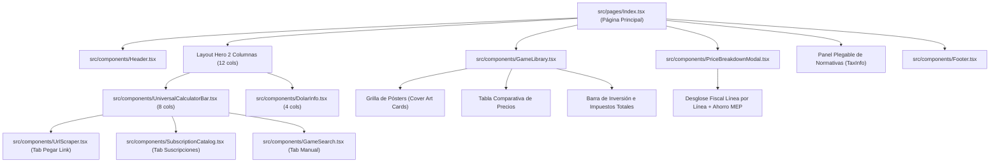

# 🎨 Guía de Contexto de Componentes y Diseño UI/UX (FRONTEND_DESIGN_CONTEXT.md)

Este documento está diseñado específicamente para que puedas **compartírselo a cualquier modelo de Inteligencia Artificial (Claude, ChatGPT, v0, etc.) o diseñador frontend**. Contiene todo el contexto de arquitectura visual, los contratos de TypeScript de cada componente, el flujo de datos y las pautas para rediseñar, cambiar estilos, paletas de colores o disposiciones sin romper la lógica del proyecto.

---

## 📋 Resumen Rápido para la IA de Diseño (Prompt Rápido)

> *"Actúa como un Diseñador UI/UX y Desarrollador Frontend Senior experto en React, Tailwind CSS y diseño de aplicaciones web modernas. Esta aplicación es **Impuesto Argento**, una herramienta para la comunidad gamer argentina que calcula impuestos oficiales en compras de videojuegos (Steam, Xbox, PlayStation, Nintendo) y servicios digitales (Game Pass, Netflix, etc.) y los organiza en una **Biblioteca Gamer Personal**.*
> 
> *Tu tarea es proponerme un rediseño visual de alta gama (paleta de colores, tipografías, jerarquía visual, bordes, estados hover, layout de tarjetas, etc.) respetando estrictamente los componentes, props de TypeScript y la lógica de negocio documentados a continuación."*

---

## 1. Concepto y Flujo de Usuario Principal

La aplicación resuelve un dolor cotidiano en Argentina: saber cuánto va a costar realmente un juego o suscripción antes de pagar con tarjeta de crédito/débito o con Dólar MEP.

### Flujo de la Experiencia:
1. **Header Sticky:** Muestra el logo oficial (`/logo-full.png`), cotizaciones del dólar en vivo y dos controles globales reactivos:
   - **Selector de Provincia:** Aplica la tasa de Ingresos Brutos (IIBB) local (0% a 5,5%).
   - **Selector de Medio de Pago:** Alterna entre `Tarjeta (ARS)` (+51% de impuestos totales) y `Dólar MEP` (+21% de IVA únicamente, exento del 30% de retención de Ganancias).
2. **Hero Dock y Cotizaciones en Vivo (Layout de 2 Columnas):**
   - **Columna Principal (8 cols):** `UniversalCalculatorBar` con 3 pestañas (Pegar Link, Suscripciones populares o Cotización manual rápida).
   - **Columna Lateral (4 cols):** `DolarInfo` con matriz 2x2 de cotizaciones en tiempo real (Oficial, Tarjeta, MEP con ahorro y Blue) más tip financiero de exención impositiva con MEP.
3. **Mi Biblioteca Gamer (`GameLibrary`):**
   - Cada juego calculado se agrega automáticamente a la colección personal del usuario (persistida en `localStorage`).
   - Se muestra como una **estantería estética de pósters/carátulas** con su precio final grande y claro en ARS.
   - En la parte superior hay una barra de métricas financieras: **Total Inversión ARS**, **Total Impuestos Retenidos** y **Ahorro Potencial con Dólar MEP**.
4. **Ticket Fiscal Transparente (`PriceBreakdownModal`):**
   - Al tocar cualquier juego o scrapear uno nuevo, se abre un comprobante limpio e interactivo con el desglose exacto (IVA 21%, Percepción Ganancias 30%, IIBB Provincial) y un botón para copiar el comprobante formateado listo para Discord o WhatsApp.
5. **Guía de Normativas Fiscales Plegable (`TaxInfo`):**
   - Panel inferior colapsable para consultar normativas legales oficiales (ARCA, Ley 27.430, RG 5617) sin saturar la pantalla principal.

---

## 2. Árbol de Componentes de la Interfaz



---

## 3. Catálogo Detallado de Componentes y sus Props

### 3.1. `Header.tsx`
* **Ruta:** `src/components/Header.tsx`
* **Función:** Barra de navegación superior fija con fondo translúcido (`backdrop-blur`). Aloja el logo, la navegación secundaria, las cotizaciones y los selectores globales.
* **Props (TypeScript):**
```ts
interface HeaderProps {
  backendOnline: boolean | null;
  dolarRates?: DolarRates;
  province?: ProvinceCode;                    // Ej: "CABA", "BA", "CBA", "ER"
  onProvinceChange?: (prov: ProvinceCode) => void;
  paymentMethod?: PaymentMethod;              // "TARJETA_ARS" | "DOLAR_MEP_CUENTA"
  onPaymentMethodChange?: (method: PaymentMethod) => void;
  onNavigateSection?: (sectionId: string) => void;
}
```

---

### 3.2. `UniversalCalculatorBar.tsx`
* **Ruta:** `src/components/UniversalCalculatorBar.tsx`
* **Función:** Contenedor unificado con pestañas (`Tabs`) que aloja los 3 métodos de entrada de la aplicación.
* **Pestañas:**
  - `url`: Renderiza `UrlScraper.tsx`
  - `catalog`: Renderiza `SubscriptionCatalog.tsx`
  - `manual`: Renderiza `GameSearch.tsx`
* **Props (TypeScript):**
```ts
interface UniversalCalculatorBarProps {
  province: ProvinceCode;
  onProvinceChange: (province: ProvinceCode) => void;
  paymentMethod: PaymentMethod;
  dolarRates: DolarRates;
  onItemCalculated: (item: CalculatedItemEvent) => void;
}

export interface CalculatedItemEvent {
  name: string;
  price: number;
  thumbnail: string;
  usdPrice?: number;
  dolarType?: "tarjeta" | "oficial" | "blue";
  isForeignDigitalService?: boolean;
  platform?: string;
  calculation?: TaxCalculationResult;
}
```

---

### 3.3. `GameLibrary.tsx` ("Mi Biblioteca Gamer")
* **Ruta:** `src/components/GameLibrary.tsx`
* **Función:** El corazón visual de la aplicación. Renderiza la colección de juegos guardados en `localStorage`.
* **Características:**
  - **Grilla de Pósters:** Carátulas con relación de aspecto 16:10 o póster 3:4, badges de tienda (`Steam`, `Xbox`, `PS`, etc.), precio base tachado/sutil y **precio final en ARS grande y destacado**.
  - **Tabla Comparativa:** Vista tabular alternativa con ordenamiento y columnas de base, impuestos, total y ahorro MEP.
  - **Métricas:** 3 tarjetas con: Inversión Total ARS, Impuestos Retenidos ARS, Ahorro con Dólar MEP.
  - **Empty State con Presets:** Si está vacía, muestra una fila de juegos recomendados (*Baldur's Gate 3, CS2, Elden Ring, Game Pass, EA FC 25, Cyberpunk 2077*) listos para sumar con 1 clic.
* **Props (TypeScript):**
```ts
interface GameLibraryProps {
  games: SavedGame[];
  province: ProvinceCode;
  paymentMethod: PaymentMethod;
  onPaymentMethodChange: (method: PaymentMethod) => void;
  dolarRates: {
    oficial: number | null;
    tarjeta: number | null;
    mep: number | null;
    blue: number | null;
  };
  onDeleteGame: (index: number) => void;
  onClearAll: () => void;
  onAddPresetGame: (game: Omit<SavedGame, "savedAt">) => void;
}
```

---

### 3.4. `PriceBreakdownModal.tsx` ("Ticket Fiscal Transparente")
* **Ruta:** `src/components/PriceBreakdownModal.tsx`
* **Función:** Modal / Dialog (Radix UI) que presenta el desglose impositivo detallado de un juego específico.
* **Elementos Visuales:**
  - Banner superior con la imagen del juego y degradado oscuro.
  - Switch interactivo `Tarjeta ARS` (+51%) vs `Dólar MEP` (+21%).
  - Precio final en tipografía mono grande.
  - Lista de impuestos oficiales:
    - IVA Servicios Digitales (21% - Decreto 813/2018)
    - Percepción Ganancias (30% - RG 5617 ARCA)
    - Percepción IIBB Provincial según alícuota
    - Impuesto PAÍS tachado (0% - Vencido)
  - Caja de recomendación de Dólar MEP con ahorro en pesos.
  - Botón "Copiar ticket" para WhatsApp / Discord.
* **Props (TypeScript):**
```ts
interface PriceBreakdownModalProps {
  isOpen: boolean;
  onClose: () => void;
  game: ModalGameData | null;
  province: ProvinceCode;
  paymentMethod: PaymentMethod;
  onPaymentMethodChange?: (method: PaymentMethod) => void;
  dolarRates: {
    oficial: number | null;
    tarjeta: number | null;
    mep: number | null;
    blue: number | null;
  };
}
```

---

### 3.5. `UrlScraper.tsx`
* **Ruta:** `src/components/UrlScraper.tsx`
* **Función:** Input con botón para pegar enlaces de Steam, Xbox, PlayStation o Nintendo. Llama a la API de scraping (`POST /api/v1/scrape-and-calculate`).
* **Props (TypeScript):**
```ts
interface UrlScraperProps {
  province: ProvinceCode;
  paymentMethod: PaymentMethod;
  onResult: (data: {
    name: string;
    price: number;
    thumbnail: string;
    usdPrice?: number;
    dolarType?: "tarjeta" | "oficial" | "blue";
    isForeignDigitalService: boolean;
    calculation?: ScrapeAndCalculateResponse["calculation"];
  }) => void;
  onSwitchToManual?: () => void;
}
```

---

### 3.6. `SubscriptionCatalog.tsx`
* **Ruta:** `src/components/SubscriptionCatalog.tsx`
* **Función:** Grilla de servicios populares (Game Pass, Netflix, Spotify, Disney+, Max, ChatGPT Plus, iCloud, etc.) con selector de planes (Básico, Estándar, Premium) y cálculo impositivo en vivo.
* **Props (TypeScript):**
```ts
interface SubscriptionCatalogProps {
  province: ProvinceCode;
  paymentMethod: PaymentMethod;
  dolarRates: {
    oficial: number | null;
    tarjeta: number | null;
    mep: number | null;
    blue: number | null;
  };
  onSelectPlan: (data: {
    name: string;
    price: number;
    thumbnail: string;
    usdPrice?: number;
    dolarType?: "tarjeta" | "oficial" | "blue";
    isForeignDigitalService: boolean;
    calculation?: TaxCalculationResult;
  }) => void;
}
```

---

### 3.7. `GameSearch.tsx`
* **Ruta:** `src/components/GameSearch.tsx`
* **Función:** Formulario manual limpio con selector integrado de moneda (USD / ARS) para cotizar montos personalizados o microtransacciones.
* **Props (TypeScript):**
```ts
interface GameSearchProps {
  onSave: (game: {
    name: string;
    price: number;
    thumbnail: string;
    usdPrice?: number;
    dolarType?: DolarType;
    isForeignDigitalService?: boolean;
    calculation?: TaxCalculationResult;
  }) => void;
  dolarRates: DolarRates;
  province: ProvinceCode;
  onProvinceChange: (province: ProvinceCode) => void;
}
```

---

### 3.8. `DolarInfo.tsx` y `TaxInfo.tsx`
* **Ruta:** `src/components/DolarInfo.tsx` y `src/components/TaxInfo.tsx`
* **Función:**
  - `DolarInfo`: Cuadrícula con cotizaciones en vivo (Oficial, Tarjeta, MEP y Blue) con botón de refresco y fuentes de datos.
  - `TaxInfo`: Tarjetas educativas que explican el marco legal de cada impuesto (IVA digital, RG 5617, IIBB y exención del Impuesto PAÍS).

---

### 3.9. `Footer.tsx`
* **Ruta:** `src/components/Footer.tsx`
* **Función:** Pie de página oficial con mención obligatoria de autoría: **"Un proyecto de Matías Casas – WrappingMati"**, enlace a redes/portafolio, descargo legal (Fair Use / Ley 24.240) y links a repositorios.

---

## 4. Sistema de Diseño Actual y Tokens

### 4.1. Paleta de Colores Vigente (Identidad Argentina Premium):
Inspirada en la bandera nacional argentina (Celeste, Blanco y Sol de Mayo) sobre un fondo oscuro moderno:

| Variable de Color | Código Hex | Clases Tailwind / Tokens | Uso Principal |
| :--- | :--- | :--- | :--- |
| **Celeste Argentino** | `#74ACDF` | `bg-[#74ACDF]`, `text-[#74ACDF]`, `border-[#74ACDF]` | Color primario, CTAs, badges de tienda, tabs activos |
| **Celeste Hover** | `#5B9CD6` | `hover:bg-[#5B9CD6]` | Estado hover de botones primarios |
| **Dorado Sol de Mayo** | `#F6B40E` | `text-[#F6B40E]`, `bg-[#F6B40E]` | Acentos de Dólar MEP, percepciones, destaques patrios |
| **Blanco Puro** | `#FFFFFF` | `text-white` | Títulos de alto contraste y detalles de bandera |
| **Fondo General (Midnight)**| `#0A0F1D` | `bg-[#0A0F1D]` | Fondo general inmersivo sin saturación |
| **Superficie de Tarjetas** | `#111A2E` | `bg-[#111A2E]` | Contenedores, cards de biblioteca, modales |
| **Bordes Sutiles** | `#1E293B` | `border-slate-800` | Bordes limpios sin destellos saturados |
| **Verde Esmeralda** | `#34D399` | `text-emerald-400` | Precios finales destacados y tickets fiscales |
| **Tipografía Base** | Slate Claro | `text-slate-100`, `text-slate-300`, `text-slate-400` | Jerarquía tipográfica accesible y de lectura ágil |

### 4.2. Assets de Marca Disponibles en `/public`:
- `public/logo-icon.png`: Isotipo de 'A' estilizada con joystick gaming. **Se utiliza en el Header en mobile (`sm:hidden`)** para que los controles globales (provincia y medio de pago) encajen perfectamente sin desbordar la barra superior.
- `public/logo-full.png`: Logo horizontal oficial (isotipo + texto "Impuesto Argento"). Se utiliza en desktop (`hidden sm:block`).
- `public/placeholder.svg`: Fallback para carátulas cuando un juego no tiene imagen.

---

## 5. Reglas y Restricciones para el Rediseño

Si le pedís a otra IA que rediseñe la interfaz, dale estas pautas:

### ✅ Lo que SÍ se puede cambiar libremente:
1. **La paleta cromática:** Podés cambiar los tonos oscuros, añadir modos claros/oscuros, o usar temas basados en plataformas (estilo Steam Dark, Epic Games Store, Cyberpunk, Minimalista OLED, etc.).
2. **El layout y distribución:** La disposición de las columnas, la forma del dock de búsqueda, la altura de las tarjetas, el formato de la grilla de pósters (vertical 3:4 o panorámico 16:9), animaciones con Framer Motion / CSS transitions.
3. **Tipografías y jerarquías:** Cambiar tamaños de fuente, espaciados (`gap`, `padding`), bordes redondeados (`rounded-xl` vs `rounded-3xl` vs `rounded-none`).
4. **Microinteracciones:** Hover en las carátulas, tooltips enriquecidos, efectos de glow suave (`shadow-violet-500/10`), banners promocionales elegantes.

### ⚠️ Lo que NO se debe romper (Contratos Técnicos):
1. **No inventar APIs nuevas:** La app consume `scrapeAndCalculateApi`, `fetchServicesCatalogApi` y `calculateArgentineTaxes`. No alteres las firmas de estas funciones.
2. **Respetar los nombres de props de los componentes:** Mantener `province`, `paymentMethod`, `dolarRates`, `onItemCalculated`, `onPaymentMethodChange`, etc.
3. **Preservar los créditos del autor en el Footer:** Debe mantenerse visible la mención a **Matías Casas – WrappingMati** y los enlaces oficiales a fuentes tributarias (ARCA / BCRA).

---

## 6. Modelos de Datos Clave (TypeScript Cheat-Sheet)

```ts
// Estado del juego en la biblioteca del usuario
export interface SavedGame {
  name: string;
  originalPrice: number;
  thumbnail: string;
  usdPrice?: number;
  dolarType?: "blue" | "oficial" | "tarjeta";
  province?: string;
  platform?: string;
  savedAt?: number;
}

// Medios de pago soportados
export type PaymentMethod = "TARJETA_ARS" | "DOLAR_MEP_CUENTA";

// Códigos de provincias argentinas
export type ProvinceCode =
  | "CABA" | "BA"  | "CBA" | "SF"  | "ER"  | "MZA"
  | "CHA"  | "LP"  | "NQN" | "RN"  | "SAL" | "TF"
  | "COR"  | "MIS" | "JUJ" | "TUC" | "SL"  | "SJ"
  | "CAT"  | "LR"  | "SDE" | "CHU" | "SC"  | "FORM"
  | "OTRA";

// Resultado del motor de impuestos
export interface TaxCalculationResult {
  baseArs: number;
  totalArs: number;
  exchangeRateUsed: number | null;
  taxes: Array<{
    id: string;
    name: string;
    amountArs: number;
    legalReference: string;
  }>;
  mepComparison?: {
    mepRate: number;
    totalWithMepArs: number;
    savingsArs: number;
    savingsPercentage: number;
    isRecommended: boolean;
  };
}
```

---

*Documento generado para **Impuesto Argento** · 2026 · Proyecto creado por Matías Casas (WrappingMati)*

